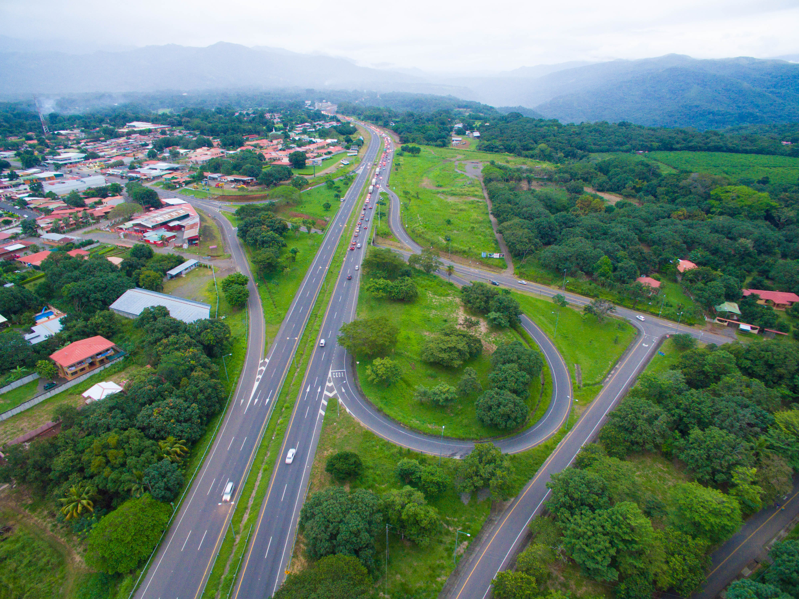
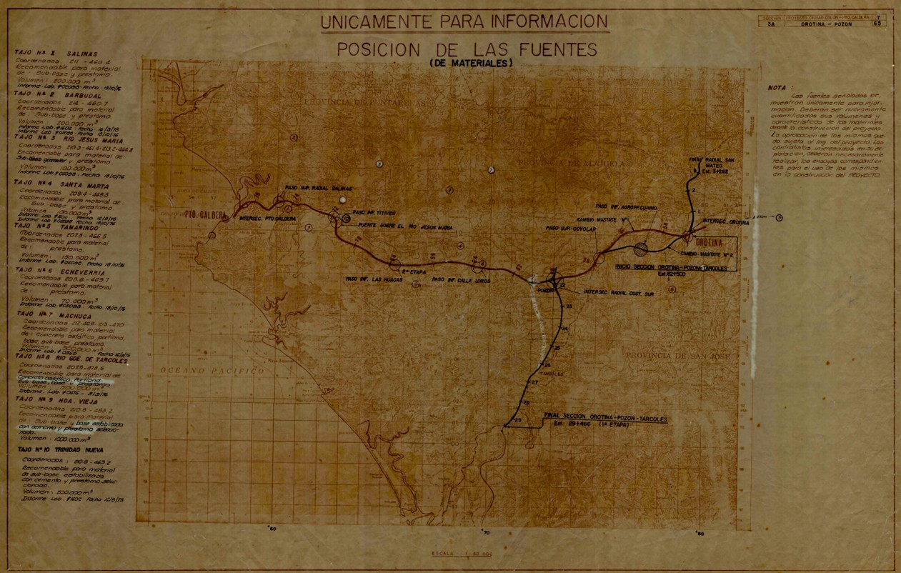

## PROYECTO-TAREA-1 ELE

### [Universidad Nacional](https://www.una.ac.cr/)

#### Facultad de Ciencias de la Tierra y el Mar.
#### Escuela de Ciencias Geográficas
#### Maestría Profesional en Sistemas de Información Geográfica.

#### TITULO: Diseño de un modelo base de datos especial que permita la sistematización y georreferenciación del ***derecho de vía en la Ruta Nacional N° 27 en concesión***.

##### ***Antedecentes***

En Costa Rica, la administración de la información territorial vinculada a los bienes inmuebles ha experimentado un proceso progresivo de modernización. Históricamente, el Registro de Bienes Inmuebles y el Catastro Nacional operaron de forma separada por más de un siglo, generando de manera independiente la información jurídica y gráfica que sustentaba los derechos de propiedad en el país. Esta separación derivó en inconsistencias y una limitada correspondencia entre la realidad física de los predios y su representación legal.

El origen del registro de la propiedad se remonta al siglo XIX, bajo la influencia de la Ley Hipotecaria española. Desde entonces, se han implementado diversas metodologías para el resguardo de la información catastral y registral, avanzando desde sistemas totalmente análogos hasta la incorporación de tecnologías digitales como imágenes satelitales, ortofotos y herramientas propias de los Sistemas de Información Geográfica (SIG). Con la creación del Registro Inmobiliario en el año 2014, adscrito al [Registro Nacional](https://www.rnpdigital.com/), se logró consolidar en una sola entidad la gestión y compatibilización de los datos gráficos y jurídicos para todo el territorio nacional.

Paralelamente, el Ministerio de Obras Públicas y Transportes (MOPT), en cumplimiento de sus competencias, ha adquirido terrenos para la conformación de derechos de vía mediante Expedientes Administrativos de Expropiación. Sin embargo, a diferencia del avance alcanzado por el Registro Inmobiliario, estos expedientes presentan un rezago significativo en cuanto a sistematización, estandarización y respaldo geoespacial. Esta situación es aún más crítica en las rutas con mayor antigüedad, donde la información se encuentra dispersa, heterogénea y con escaso soporte tecnológico.

Como consecuencia, existe incertidumbre en la delimitación y ubicación precisa de las franjas expropiadas, lo que afecta la vigilancia y administración de los bienes demaniales del Estado y limita la capacidad institucional para afrontar conflictos de ocupación o invasiones en el derecho de vía.

La Ruta Nacional N° 27 es un ejemplo representativo de esta realidad. Su planificación se inició en la década de 1980, con el propósito de conectar de manera eficiente el Gran Área Metropolitana con el Puerto de Caldera, considerado estratégico para el comercio en el Pacífico. No obstante, la falta de recursos y continuidad política impidió concluir la obra en esa etapa. Posteriormente, gracias a la aprobación de la Ley N° 7404 en 1994 y su reforma, la Ley N° 7762 en 1998, se abrió la posibilidad de finalizar el proyecto mediante el modelo de concesión de obra pública.

<video width="400" height="350" controls>
  <source src="video.mp4" type="video/mp4">
 </video>

#### ***Problema:***

El Ministerio de Obras Públicas y Transportes [MOPT](https://www.mopt.go.cr/) carece de un sistema automatizado que permita la gestión territorial integral y georreferenciada de los bienes del Estado que conforman el derecho de vía de la Ruta Nacional N° 27. La información existente se encuentra dispersa, incompleta y sin estandarización, lo que dificulta determinar con precisión la delimitación del derecho de vía y afecta la adecuada administración de los terrenos bajo la figura de la Concesión de Obra Pública.

#### ***Justificación del problema:***

En relación con la necesidad de ubicar, delimitar y resguardar los bienes inmuebles a favor del Estado costarricense, administrados por el Ministerio de Obras Públicas y Transportes (MOPT) y destinados a conformar el derecho de vía de las carreteras nacionales, cabe señalar que, de acuerdo con la legislación vigente, dichos bienes constituyen bienes demaniales del Estado, destinados al uso público y sujetos a un régimen jurídico de protección, al ser considerados inalienables, imprescriptibles e inembargables. Estos bienes cumplen una función esencial en el desarrollo social y en el bienestar colectivo de la sociedad, al permitir la ejecución de obras públicas de gran necesidad y, en algunos casos, de gran envergadura para el desarrollo económico nacional.

El presente proyecto tiene como objetivo desarrollar un procedimiento técnico que, mediante el uso de un sistema de base de datos espacial el cual se pueda alimentar una aplicación SIG, imágenes Orto rectificadas y bases de datos espaciales, permita reconstruir de forma precisa la información contenida tanto en los expedientes administrativos del MOPT como en los asientos registrales y catastrales del Registro de la Propiedad, actualmente Registro Inmobiliario.

#### ***Alcance del proyecto:***

El presente estudio se desarrollará en un segmento de la Ruta Nacional N.° 27 (Carretera San José – Caldera), específicamente en la Sección I: Sabana – Intercambio Ciudad Colón, dentro del tramo comprendido entre el Intercambio Guachipelín Pk 7+400 y el Intercambio Villa Real Pk 9+600.

Este sector se localiza dentro de los límites administrativos de dos cantones de la provincia de San José: Escazú y Santa Ana, por lo que la investigación considerará la información territorial y catastral correspondiente a ambos gobiernos locales.

#### ***Objetivo General:***

Proponer un procedimiento técnico que permita reconstruir, depurar, integrar y contrastar espacialmente la información contenida en los expedientes administrativos del MOPT y en los asientos registrales y catastrales del Registro Inmobiliario, mediante el uso de sistemas de información geográfica (SIG), imágenes orto rectificadas y bases de datos espaciales, con el fin de determinar con precisión la ubicación, delimitación y cabida de las franjas de terreno que conforman el derecho de vía de las rutas nacionales, y así contribuir a una gestión más eficiente, transparente y técnicamente fundamentada de los bienes demaniales del Estado.

#### ***Objetivo Específicos:***

- Recopilar la documentación generada en los procesos de expropiación del MOPT —tales como declaratorias de interés público, números de finca, nombres de propietarios, planos esquemáticos y de diseño, entre otros, con el fin de disponer de la información administrativa necesaria para el análisis.

- Diagnosticar la información disponible en fuentes complementarias como:
    - Mapas municipales
    - Mapas de zonas catastrales.
    - Entre otros.

- Levantar la información registral y catastral correspondiente a las fincas madres y a las fincas adquiridas por el Estado, a partir de los tomos del Registro de la Propiedad y de los planos inscritos en el Catastro Nacional, con el propósito de vincular la información gráfica y literal.

- Organizar y analizar las imágenes orto rectificadas disponibles en el Instituto Geográfico Nacional, a fin de delimitar con mayor precisión los linderos de las propiedades involucradas.

- Contrastar la información proveniente de los expedientes administrativos del MOPT, los asientos registrales y catastrales del Registro Inmobiliario y los linderos observados en ortofotos, con el fin de detectar inconsistencias y corroborar la validez de los datos.

- Clasificar y sistematizar la información gráfica y literal obtenida tras el contraste de fuentes, para estructurar un insumo homogéneo y confiable en el análisis.

- Digitalizar y estructurar la información recopilada en un modelo entidad-relación, con el propósito de conformar una base de datos geográfica que sirva de soporte técnico al procedimiento propuesto.

- Integrar y sobreponer el mosaico catastral de los cantones de San José y Escazú, incluyendo las propiedades colindantes a la Ruta Nacional N.º 27, con el fin de obtener una representación espacial unificada del área de estudio.

- Identificar las áreas en las que se presentan afectaciones al derecho de vía de la Ruta Nacional N.º 27, con el objetivo de evidenciar posibles invasiones o inconsistencias en la gestión de dichos bienes demaniales.
